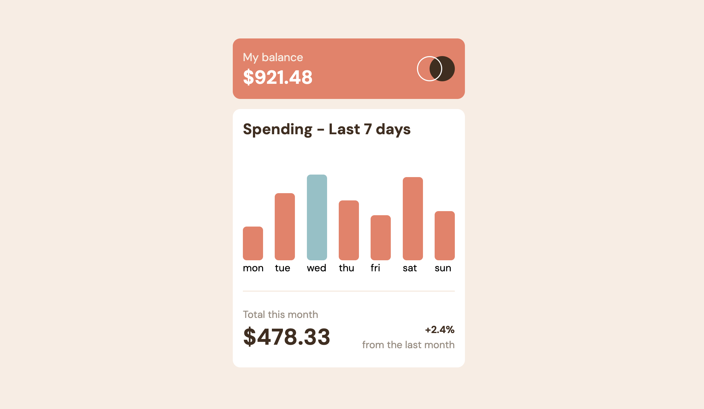

# Frontend Mentor - Expenses chart component solution

This is a solution to the [Expenses chart component challenge on Frontend Mentor](https://www.frontendmentor.io/challenges/expenses-chart-component-e7yJBUdjwt). Frontend Mentor challenges help you improve your coding skills by building realistic projects.

## Table of contents

- [Overview](#overview)
  - [The challenge](#the-challenge)
  - [Screenshot](#screenshot)
  - [Links](#links)
- [My process](#my-process)
  - [Built with](#built-with)
  - [What I learned](#what-i-learned)
- [Author](#author)

## Overview

### The challenge

Users should be able to:

- View the bar chart and hover over the individual bars to see the correct amounts for each day
- See the current day’s bar highlighted in a different colour to the other bars
- View the optimal layout for the content depending on their device’s screen size
- See hover states for all interactive elements on the page
- **Bonus**: Use the JSON data file provided to dynamically size the bars on the chart

### Screenshot

### Links

- Solution URL: [GitHub](https://github.com/piyush-kaushik24/expenses-chart-component)
- Live Site URL: [Expenses chart component](<>)

## My process

### Built with

- Semantic HTML5 markup
- CSS custom properties
- Flexbox
- CSS Grid
- Mobile-first workflow
- [TypeScript](https://www.typescriptlang.org/)
- [React](https://react.dev/) - JS library
- [Tailwind CSS](https://tailwindcss.com/) - CSS framework

### What I learned

- Rendering chart bars dynamically from data using `.map()`
- Calculating dynamic bar heights using percentages
- Using inline styles in React for dynamic CSS values
- Building the chart layout with Flexbox
- Using Tailwind's `group` and `group-hover` for hover interactions
- Creating hover tooltips to display data dynamically
- Working with TypeScript types for chart data

## Author

- GitHub - [@piyush-kaushik24](https://github.com/piyush-kaushik24)
- Frontend Mentor - [@piyush-kaushik24](https://www.frontendmentor.io/profile/piyush-kaushik24)
